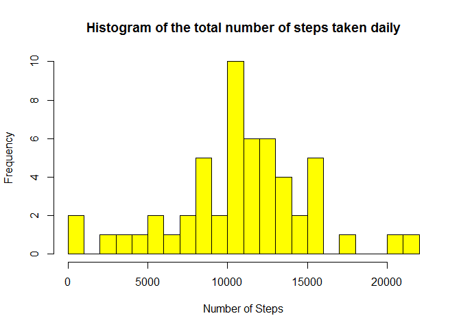
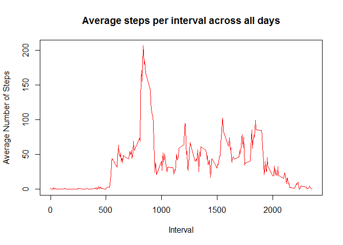
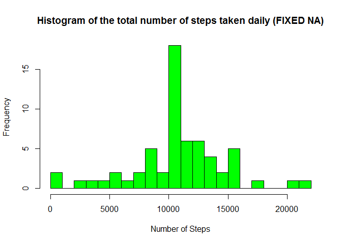
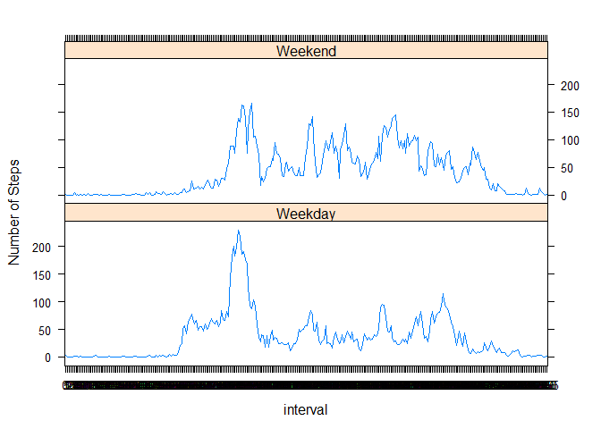

# Reproducible Research: Peer Assessment 1
Andrey(aquilaT)  
3 апреля 2016 г.  


## Loading and preprocessing the data

loading data from the web

```r
temp <- tempfile()
download.file("https://d396qusza40orc.cloudfront.net/repdata%2Fdata%2Factivity.zip", temp, mode="wb")
unzip(temp, "activity.csv")
data <- read.csv("activity.csv", header = TRUE, sep = ",", na.strings = "NA")
```

understanding the data dimensions

```r
dim(data)
```

```
## [1] 17568     3
```

understanding the columns names

```r
names(data)
```

```
## [1] "steps"    "date"     "interval"
```

understanding data top 6 rows

```r
head(data)
```

```
##   steps       date interval
## 1    NA 2012-10-01        0
## 2    NA 2012-10-01        5
## 3    NA 2012-10-01       10
## 4    NA 2012-10-01       15
## 5    NA 2012-10-01       20
## 6    NA 2012-10-01       25
```

understanding data bottom 6 rows

```r
tail(data)
```

```
##       steps       date interval
## 17563    NA 2012-11-30     2330
## 17564    NA 2012-11-30     2335
## 17565    NA 2012-11-30     2340
## 17566    NA 2012-11-30     2345
## 17567    NA 2012-11-30     2350
## 17568    NA 2012-11-30     2355
```

understanding the data summary

```r
summary(data)
```

```
##      steps                date          interval     
##  Min.   :  0.00   2012-10-01:  288   Min.   :   0.0  
##  1st Qu.:  0.00   2012-10-02:  288   1st Qu.: 588.8  
##  Median :  0.00   2012-10-03:  288   Median :1177.5  
##  Mean   : 37.38   2012-10-04:  288   Mean   :1177.5  
##  3rd Qu.: 12.00   2012-10-05:  288   3rd Qu.:1766.2  
##  Max.   :806.00   2012-10-06:  288   Max.   :2355.0  
##  NA's   :2304     (Other)   :15840
```

understanding the data structure

```r
str(data)
```

```
## 'data.frame':	17568 obs. of  3 variables:
##  $ steps   : int  NA NA NA NA NA NA NA NA NA NA ...
##  $ date    : Factor w/ 61 levels "2012-10-01","2012-10-02",..: 1 1 1 1 1 1 1 1 1 1 ...
##  $ interval: int  0 5 10 15 20 25 30 35 40 45 ...
```

converting "date"" from Factor to Date Class and converting "interval" from integer to factor

```r
data$date <- as.Date(data$date, format = "%Y-%m-%d")
data$interval <- factor(data$interval)
```

## What is mean total number of steps taken per day?

TASKS: 

For this part of the assignment, you can ignore the missing values in the dataset.

  (1) Make a histogram of the total number of steps taken each day

  (2) Calculate and report the mean and median total number of steps taken per day

calculating how many steps were taken each day

```r
daily_steps <- aggregate(steps ~ date, data = data, sum)
colnames(daily_steps) <- c("date", "steps")
```

Making a histogram of the total number of steps taken each day


```r
hist(as.numeric(daily_steps$steps), breaks = 30, col = "yellow", xlab = "Number of Steps", main= "Histogram of the total number of steps taken daily")
```



Calculate and report the mean total number of steps taken per day


```r
mean(daily_steps$steps)
```

```
## [1] 10766.19
```

Calculate and report the median total number of steps taken per day


```r
median(daily_steps$steps)
```

```
## [1] 10765
```

## What is the average daily activity pattern?

TASKS:

  (1) Make a time series plot (i.e. type = "l") of the 5-minute interval (x-axis) and the average number of steps taken, averaged across all days (y-axis) 

  (2) Which 5-minute interval, on average across all the days in the dataset, contains the maximum number of steps?


```r
av_steps_per_interval <- aggregate(data$steps, by=list(interval=data$interval), FUN=mean, na.rm=TRUE, na.action=NULL)
colnames(av_steps_per_interval) <- c("interval", "average_steps")
plot(as.integer(levels(av_steps_per_interval$interval)), av_steps_per_interval$average_steps, type="l", xlab = "Interval", ylab = "Average Number of Steps", main = "Average steps per interval across all days",  col  ="red")
```



let's find the 5-minute interval, on average across all the days in the dataset, contains the maximum number of steps

```r
interval_with_max_steps <- av_steps_per_interval[which.max(av_steps_per_interval$average_steps),]$interval
interval_with_max_steps
```

```
## [1] 835
## 288 Levels: 0 5 10 15 20 25 30 35 40 45 50 55 100 105 110 115 120 ... 2355
```

let's find the maximum number of steps per interval, on average across all the days in the dataset

```r
max_steps <- max(av_steps_per_interval$average_steps)
max_steps
```

```
## [1] 206.1698
```


## Imputing missing values

TASK:

Note that there are a number of days/intervals where there are missing values (coded as NA). The presence of missing days may introduce bias into some calculations or summaries of the data.

(1) Calculate and report the total number of missing values in the dataset (i.e. the total number of rows with NAs)

(2) Devise a strategy for filling in all of the missing values in the dataset. The strategy does not need to be sophisticated. For example, you could use the mean/median for that day, or the mean for that 5-minute interval, etc.

(3) Create a new dataset that is equal to the original dataset but with the missing data filled in.

(4) Make a histogram of the total number of steps taken each day and Calculate and report the mean and median total number of steps taken per day. Do these values differ from the estimates from the first part of the assignment? What is the impact of imputing missing data on the estimates of the total daily number of steps?


The total number of missing values in the dataset in STEPS column


```r
sum(is.na(as.character(data$steps)))
```

```
## [1] 2304
```

The total number of missing values in the dataset in INTERVAL column


```r
sum(is.na(as.character(data$interval)))
```

```
## [1] 0
```

The total number of missing values in the dataset in DATE column


```r
sum(is.na(as.character(data$date)))
```

```
## [1] 0
```

Hence we conclude that only some values of STEPS are missing, and the total number of misssing values for STEPS is 2304 among 17568 measures, so the data set is missing approx 13% of all values 

Now we are going to fill in all of the missing values in the dataset by using the mean for that 5-minute interval


```r
NA_vector <- which(is.na(as.character(data$steps)))
full_data <- data
full_data[NA_vector, ]$steps<-unlist(lapply(NA_vector, FUN=function(NA_vector){
                av_steps_per_interval[data[NA_vector,]$interval==av_steps_per_interval$interval,]$average_steps
}))
```

Making sure that new full dataset does not contain any missing values


```r
sum(is.na(as.character(full_data$steps)))
```

```
## [1] 0
```


```r
summary(full_data)
```

```
##      steps             date               interval    
##  Min.   :  0.00   Min.   :2012-10-01   0      :   61  
##  1st Qu.:  0.00   1st Qu.:2012-10-16   5      :   61  
##  Median :  0.00   Median :2012-10-31   10     :   61  
##  Mean   : 37.38   Mean   :2012-10-31   15     :   61  
##  3rd Qu.: 27.00   3rd Qu.:2012-11-15   20     :   61  
##  Max.   :806.00   Max.   :2012-11-30   25     :   61  
##                                        (Other):17202
```


```r
str(full_data)
```

```
## 'data.frame':	17568 obs. of  3 variables:
##  $ steps   : num  1.717 0.3396 0.1321 0.1509 0.0755 ...
##  $ date    : Date, format: "2012-10-01" "2012-10-01" ...
##  $ interval: Factor w/ 288 levels "0","5","10","15",..: 1 2 3 4 5 6 7 8 9 10 ...
```

plotting a histogram for the FULL DATA where we fixed all NAs


```r
fulldata_steps_each_day <- aggregate(steps ~ date, data = full_data, sum)
colnames(fulldata_steps_each_day) <- c("date", "steps")
hist(as.numeric(fulldata_steps_each_day$steps), breaks = 30, col = "green", xlab = "Number of Steps", main= "Histogram of the total number of steps taken daily (FIXED NA)")
```



calculating MEAN for the full dataset


```r
mean(fulldata_steps_each_day$steps)
```

```
## [1] 10766.19
```

calculating MEDIAN for the full dataset


```r
median(fulldata_steps_each_day$steps)
```

```
## [1] 10766.19
```

We conclude that after fixing NA the values of MEAN didn't change, although MEDIAN's change is very minor 


```r
mean(daily_steps$steps)
```

```
## [1] 10766.19
```


```r
median(daily_steps$steps)
```

```
## [1] 10765
```


## Are there differences in activity patterns between weekdays and weekends?

TASK:

For this part the weekdays() function may be of some help here. Use the dataset with the filled-in missing values for this part.

(1) Create a new factor variable in the dataset with two levels -- "weekday" and "weekend" indicating whether a given date is a weekday or weekend day.

(2) Make a panel plot containing a time series plot (i.e. type = "l") of the 5-minute interval (x-axis) and the average number of steps taken, averaged across all weekday days or weekend days (y-axis). The plot should look something like the following, which was created using simulated data:


Creating a new factor variable in the dataset to assign to each day either "weekday" or "weekend"

```r
full_data$day <- as.factor(weekdays(full_data$date))

full_data$is_weekday <- ifelse(!(full_data$day %in% c("суббота","воскресенье")), TRUE, FALSE) 
```

Making a panel plot containing a time series plot (i.e. type = "l") of the 5-minute interval (x-axis) and the average number of steps taken, averaged across all weekday days or weekend days (y-axis). 


```r
weekdays_data <- full_data[full_data$is_weekday,]
steps_per_interval_weekdays <- aggregate(weekdays_data$steps, by=list(interval=weekdays_data$interval), FUN=mean)
weekends_data <- full_data[!full_data$is_weekday,]
steps_per_interval_weekends <- aggregate(weekends_data$steps, by=list(interval=weekends_data$interval), FUN=mean)
colnames(steps_per_interval_weekdays) <- c("interval", "average_steps")
colnames(steps_per_interval_weekends) <- c("interval", "average_steps")
steps_per_interval_weekdays$day <- "Weekday"
steps_per_interval_weekends$day <- "Weekend"
week_data <- rbind(steps_per_interval_weekends, steps_per_interval_weekdays)
week_data$day <- as.factor(week_data$day)
library(lattice)
xyplot(average_steps ~  interval | day, data = week_data, layout = c(1,2), type ="l", ylab="Number of Steps")
```



CONCLUSIONS

By comparing WEEKDAYS vs WEEKENDS patterns, we conclude that there is a difference in activity:

(1) walking activity on weekends starts LATER in the morning (presumably the subject stays in bed longer
(2) peak activity on the mornings of weekdays is not repeated over weekends: our individual doesn't walk much during same time of weekends
(3) throughout the weekend, in general, the average walking activity is higher than during the same time of weekdays  


